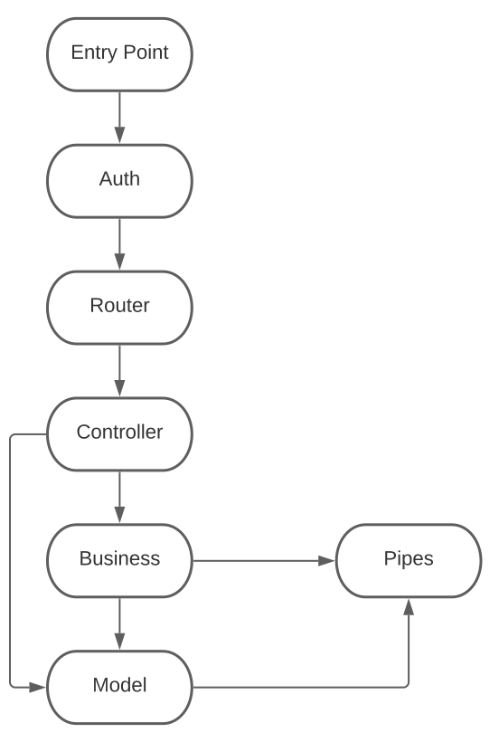

# backend-architecture
A way to standardize and manage backend code to make it reusable (not only code but also reuse ideas) and predictable, this way incrementing simplicity across the organization.


## Layers overview
The codebase will be split into multiple layers, each of these layers will solve a concrete problem, the goal is to achieve:

1. Low coupling and high cohesion.
1. Separation of concerns.
1. Adaptability.
1. Reusability.
1. Avoid circular references between layers.
1. Depending on abstractions and avoid depending on implementation details.
1. Layers should be substitutable.
1. Layers will have very well-defined boundaries and responsibilities.


## Layers and their responsibilities


### Main entry point:
This will be a single file (typically will be `app.js` or `index.js`) at the root of the codebase.
The main task is to instantiate and call any needed resources. Is in this file where connections to DBs are called (not defined just called) and the router is wired up.

### Auth
Will analyze the request before the router itself and will validate that the current user can access the resource is asking for.

### Router
The router's main task is to keep track of the endpoints and the HTTP verbs they use.
The router is then responsible for validating the request and forwarding it to the concrete controller that should handle it.

### Controller
The controller's responsibility is to process the request, call the correct business logic, and return the results.
The controller will abstract the fact that we are using HTTP away from the business logic layer, this means that the controller will have very little code itself and will act only as a means to translate an HTTP request to parameters that will pass to the appropriate business logic.

### Middleware
Express-related middleware that is not the routes and controllers, like for example the errorHandler or any other middleware the app may need.

### Business
The business layer will contain the business logic itself. Is made of Domain-specific tasks and won't be aware of details like what DB or DBs is the app using, also it won't be aware of higher-level layers like the controller. It will use other lower layers like models or pipes (plugins)

Depending on the complexity of the application this layer may not be needed, if the problem is simple enough probably direct calls from the controller to the model will do.

In complex applications, business logic is too big to be held on the model (Active Record classes). Instead, other patterns can be implemented like [Domain Model](https://martinfowler.com/eaaCatalog/domainModel.html) and [Data Mapper](https://martinfowler.com/eaaCatalog/dataMapper.html) but the main objective of this layer is to have a place to store the complex business logic. This layer won't know about the details of the application, like what type of DB is being used. The controllers can invoke them but they will get only the data they need in the format they need it and won't know about the existence of controllers but they can know about the existence of the model classes and will use them to get the data they need.

### Model
Is the layer that will communicate with the database, if the application is small enough, it can even contain the business logic. The recommended pattern is the [Active Record](https://www.martinfowler.com/eaaCatalog/activeRecord.html).
The model will contain all the knowledge about the data itself and how to access it and or modify it. It is where we use ORMs (like Sequelize).

### Pipes (or Plugins)
Will be 3rd party integrations with other systems, these integrations should be made in a way that the failure on other systems does not propagate and break our system, this is possible only when we only need to send data or do certain actions on other systems and our system itself do not depend on it.


### Other non-layer parts
The application will also need to store and keep track of:

- Config:
Will contain all the configuration files, even when configurations are being done using environment variables. Every configuration must go into a specific file and should be imported where needed. This works as a source of truth and helps keep every configuration accounted for across the application.

- db (Database connections): Code to connect to the different databases the application needs, normally we will have a file inside config with the values we need to connect to a database and another file with the actual logic to connect to the database within this folder.
We will use one file per DB.

- utils (helpers) : Can be functions, classes etc. This is a vague category regarding concrete implementation because a utility can be of many types depending on the problem it solves. Utilities should also be used as a layer between third-party libraries and our code (eg hiding Axios or MomentJS) so we don't fully depend on third-party libraries and give the possibility to replace them in the future if needed.

- docs: This folder will contain text files (txt, markdown, etc..) documenting the application and can include the ADRs (Architecture Decision Records) or other information that can be useful. The idea of having the documentation in simple text files is that it can evolve with the code and be tracked using the version control system.


## Example Folder structure
```
├── app.js
├── auth
│   ├── admin.js
│   ├── client.js
│   └── index.js
├── config
│   ├── app.js
│   ├── db.js
│   ├── env.js
│   └── key.js
├── controllers
│   ├── admin.js
│   ├── client.js
│   └── nomenclator.js
├── db
│   └── main.js
├── docs
│   ├── Admin.md
│   ├── Nomenclator.md
│   └── Client.md
├── logic
│   ├── admin
│   │   ├── charge.js
│   │   ├── create.js
│   │   ├── list
│   │   │   ├── guest-handler.js
│   │   │   └── index.js
│   │   ├── nomenclators.js
│   │   ├── payment.js
│   │   ├── schedule.js
│   │   └── update.js
│   └── client
│       ├── cancel.js
│       └── checkin.js
├── middleware
│   ├── errorHandler.js
│   └── headers.js
├── models
│   ├── charge.js
│   ├── client.js
│   ├── dispute.js
│   ├── nomenclator.js
│   ├── notification.js
│   ├── querys
│   │   ├── disputeList.js
│   │   ├── findOneByCode.js
│   │   ├── listReservations.js
│   │   ├── nomenclatorsNames.js
│   │   └── paymentReservations.js
│   ├── reservation_has_nomenclator.js
│   └── reservation.js
├── pipes
│   └── stripe
│       ├── config.js
│       └── index.js
├── routes
│   ├── admin.js
│   ├── client.js
│   ├── nomenclator.js
│   ├── index.js
│   └── rules
│       ├── admin
│       │   ├── charge.js
│       │   ├── create.js
│       │   ├── date.js
│       │   ├── loadReservation.js
│       │   ├── payment.js
│       │   ├── regex.js
│       │   └── schedule.js
│       ├── client.js
│       ├── errorHandler.js
│       └── nomenclator
│           ├── create.js
│           ├── delete.js
│           ├── update.js
│           └── view.js
└── utils
    ├── date.js
    ├── httpErrors.js
    ├── mailtransporter.js
    └── uuid.js
```
